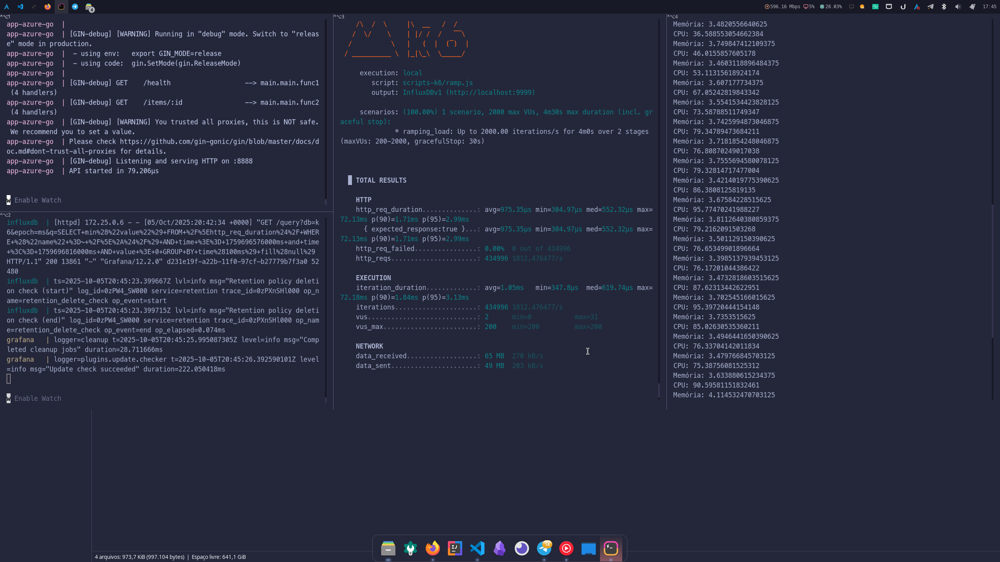

# poc-api-cosmos-dynamo-go

API de exemplo em Go para integração com Azure CosmosDB e DynamoDB.

## Como executar CosmosDB

O fluxo recomendado é rodar tudo via Docker Compose, a partir da pasta `docker`:

```sh
docker-compose up --build
```

Isso irá:
- Subir o CosmosDB emulador
- Executar o seed automaticamente (preenchendo o arquivo `uuids.txt` na raiz do projeto)
- Subir a API Go em `http://localhost:8888`
- Subir o Jaeger com a IU acessível em `http://localhost:16686`

## Como executar DynamoDB

O fluxo recomendado é rodar tudo via Docker Compose, a partir da pasta `docker`:

```sh
docker-compose -f docker-compose.dynamo.yml up --build
```

Isso irá:
- Subir o DynamoDB local
- Executar o seed automaticamente (preenchendo o arquivo `uuids.txt` na raiz do projeto)
- Subir a API Go em `http://localhost:8888`
- Subir o Jaeger com a IU acessível em `http://localhost:16686`

## Pré-requisitos

- Docker

## Endpoints

- `GET /health` — Healthcheck
- `GET /items/:id` — Busca um relacionamento pelo ID (retorna 204 se não encontrado)

## Observações

- O projeto ignora a validação de certificados TLS para facilitar testes locais. Não usar em produção!
- O campo `id` não é retornado pela API, apenas os dados de relacionamento.
- Retorno 204 caso o item não seja encontrado.

## Testes de Performance

### Pré-requisitos

- Docker
- K6

### Preparando o ambiente

- Subir um dos Docker Compose de aplicação como visto anteriormente.
- Na pasta `docker` executar os seguintes comandos para criar as pastas de volume compartilhado para persistências das configurações e dar permissão para escrita:
  - `mkdir -p ./grafana-data`
  - `mkdir -p ./influxdb-data`
  - `sudo chown -R 472:472 ./grafana-data`
  - `sudo chown -R 1000:1000 ./influxdb-data`
- Executar o comando `docker-compose -f docker-compose.dashboard.k6.yml up` para subir o Grafana e o InfluxDB que será utilizado como datasource para o Grafana.
- Acessar o Grafana em `http://localhost:3000/` no navegador, com o usuário e senha `admin`
- No Grafana, adicionar o Datasource do InfluxDB com os valores `http://influxdb:8086` para a URL e `k6` como nome do database.
- Adicionar um dashboard para acompanhamento do teste do K6.
  - Exemplo do dash utilizado (com modificações e correções): https://grafana.com/grafana/dashboards/2587-k6-load-testing-results/
- Você pode opcionalmente acessar a pasta `docker-monitor` a partir da raiz para acompanhar o consumo de memória e CPU. Basta passar como parâmetro o nome da imagem, como visto com o comando `docker stats`. Por exemplo: `python3 docker-monitor.py app-azure-go`
- Por fim, a partir da raiz do projeto, executar o comando para execução do cenário com o K6, informando o caminho com a porta exposta no host para o InfluxDB.
  - Exemplo para o cenário Azure: `k6 run --out influxdb=http://localhost:9999/k6 scripts-k6/ramp-azure.js`

### Diferenças dos Cenários

O comportamento das SDKs é bem diferente. Por esse motivo foram criados cenários apartados para cada um deles. As diferenças podem também estar associadas aos diferentes mecanismos para simular o banco de dados localmente. É necessário testar em um ambiente mais próximo do real para de fato gerar conclusão em relação à performance das aplicações.

Para o cenário `AWS`, foi possível manter valores mais altos e por mais tempo, sem grandes problemas no processamento da aplicação, apesar de ter sido identificado um consumo alto de CPU. Abaixo os resultados e mais detalhes em cada um dos cenários.

### Resultados

Antes de qualquer coisa, podemos observar o tempo de inicialização da aplicação em Go, que é transparente em qualquer cenário:



### AWS

> Cenário simulado:
```js
export const options = {
  scenarios: {
    ramping_load: {
      executor: 'ramping-arrival-rate',
      startRate: 500,
      timeUnit: '1s',
      preAllocatedVUs: 200,
      maxVUs: 2000,
      stages: [
        { target: 2000, duration: '1m' },
        { target: 2000, duration: '3m' },
      ],
    },
  },
};
```

> Consumo de recursos durante a execução


> Painel do grafana durante a execução


> Trace de amostragem no Jaeger


> Resultado K6
```shell
  █ TOTAL RESULTS 

    HTTP
    http_req_duration..............: avg=427.81ms min=512.06µs med=972.21µs max=7.92s p(90)=2.26s p(95)=3.23s
      { expected_response:true }...: avg=427.81ms min=512.06µs med=972.21µs max=7.92s p(90)=2.26s p(95)=3.23s
    http_req_failed................: 0.00%  0 out of 227320
    http_reqs......................: 227320 937.526554/s

    EXECUTION
    dropped_iterations.............: 42678  176.015125/s
    iteration_duration.............: avg=427.92ms min=554.98µs med=1.06ms   max=7.92s p(90)=2.26s p(95)=3.23s
    iterations.....................: 227320 937.526554/s
    vus............................: 1204   min=0           max=2000
    vus_max........................: 2000   min=200         max=2000

    NETWORK
    data_received..................: 43 MB  178 kB/s
    data_sent......................: 26 MB  105 kB/s
```

> Cenário simulado:
```js
export const options = {
  scenarios: {
    ramping_load: {
      executor: 'ramping-arrival-rate',
      startRate: 500,
      timeUnit: '1s',
      preAllocatedVUs: 200,
      maxVUs: 2000,
      stages: [
        { target: 1000, duration: '1m' },
        { target: 1500, duration: '3m' },
      ],
    },
  },
};
```

> Consumo de recursos durante a execução


> Painel do grafana durante a execução


> É importante observar que, enquanto não ocorreu o gargalo no uso de CPU, que levou ao aumento de memória, os resultados até então, haviam sido excelentes, perto do valor de 1350 TPS.


> Trace de amostragem no Jaeger


> Resultado K6
```shell
  █ TOTAL RESULTS 

    HTTP
    http_req_duration..............: avg=975.35µs min=304.97µs med=552.32µs max=72.13ms p(90)=1.71ms p(95)=2.99ms
      { expected_response:true }...: avg=975.35µs min=304.97µs med=552.32µs max=72.13ms p(90)=1.71ms p(95)=2.99ms
    http_req_failed................: 0.00%  0 out of 434996
    http_reqs......................: 434996 1812.476477/s

    EXECUTION
    iteration_duration.............: avg=1.05ms   min=347.8µs  med=619.74µs max=72.18ms p(90)=1.84ms p(95)=3.13ms
    iterations.....................: 434996 1812.476477/s
    vus............................: 2      min=0           max=31 
    vus_max........................: 200    min=200         max=200

    NETWORK
    data_received..................: 65 MB  270 kB/s
    data_sent......................: 49 MB  203 kB/s
```